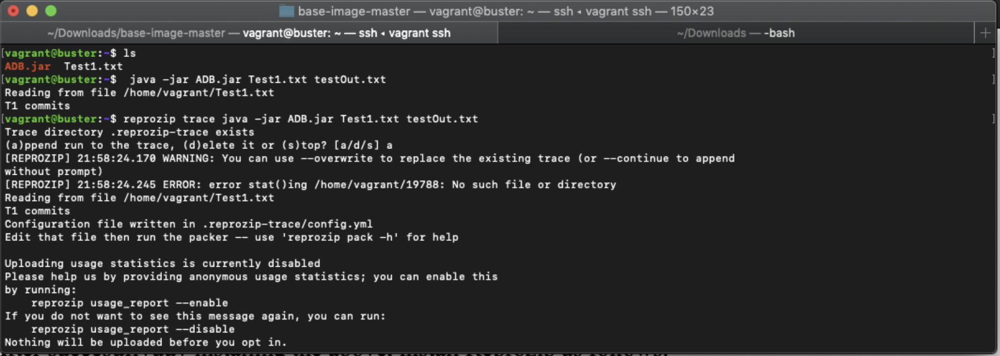

I recently had to pack a project with **Reprozip** where all the dependencies can be nicely preserved. Reprozip uses ptrace and thus only works on Linux, which means I had to set up a linux environment on my Mac. I mean, you can't call yourself a software engineer without having a Linux (virtual) machine, can you?! 😓

In case someone out there are faced with the same task, I've documented my setup process in this post.

## My Environment

macOS Catalina 10.15.1

## Install Reprozip

### Install VirtualBox Or Equivalent

Vagrant needs VirtualBox to run.

Download installer here: https://www.virtualbox.org/wiki/Downloads

If the installer failed, you may need to enable its kernel extension in: **System Preferences → Security & Privacy → General**

### Install Vagrant Or Equivalent

Download the installer for MacOS from https://www.vagrantup.com/downloads.html.

Click, install, done.

Then create `Vagrantfile`:

```sh
$ vagrant init hashicorp/bionic64
```

Set up VM:

```sh
$ vagrant up
```

After running the above two commands, you will have a fully running virtual machine in VirtualBox running Ubuntu 12.04 LTS 64-bit.

### ssh into VM

```sh
$ vagrant ssh
```

### Set up virtualenv

**IMPORTANT**: make sure to run an update on the package index in the VM before procedding:

```sh
$ sudo apt update
```

#### install `virtualenv` with `pip`

```sh
$ sudo apt install virtualenv
```

check if installation was successful:

```sh
$ virtualenv --version
```

#### create an env

```sh
$ virtualenv -p /usr/bin/python <name>
```

#### activate an env

```sh
$ source DBenv/bin/activate
```

### Install Pre-reqs For Reprozip

```sh
$ sudo apt-get install python-dev
$ sudo apt-get install python-pip
$ sudo apt-get install sqlite3
$ sudo apt-get install libsqlite3-dev
```

### Finally, Install Reprozip

```sh
$ pip install reprozip
$ pip install reprounzip
```

## Run Reprozip

### Bring The Executable Into The Environment For Packaging

In order to use `scp`, we need to install a plugin:

```sh
$ vagrant plugin install vagrant-scp
```

Note that this goes from **local** to **linux**:

```sh
$ vagrant scp <local_path> [vm_name]:<remote_path>
```

More about how scp in/out of a Vagrant VM: https://github.com/invernizzi/vagrant-scp.

In case you didn't know your **[vm_name]** just like myself, here's how you track it down:

```sh
$ vagrant status
```

### Run Trace and Pack

We’ll first trace all the system calls in execution by using Reprozip trace command:

```sh
$ reprozip trace <command>
```



```sh
$ reprozip pack <pack-name>
```

It gives an .rpz file which can then be `scp`ed to other system environments and be unzipped and ran.

### Terminate a VM

when you are done playing around, you can terminate the virtual machine with:

```sh
$ vagrant destroy
```
