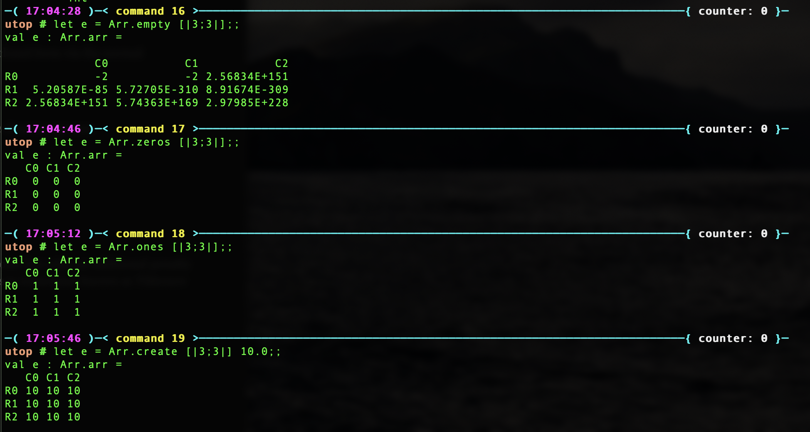
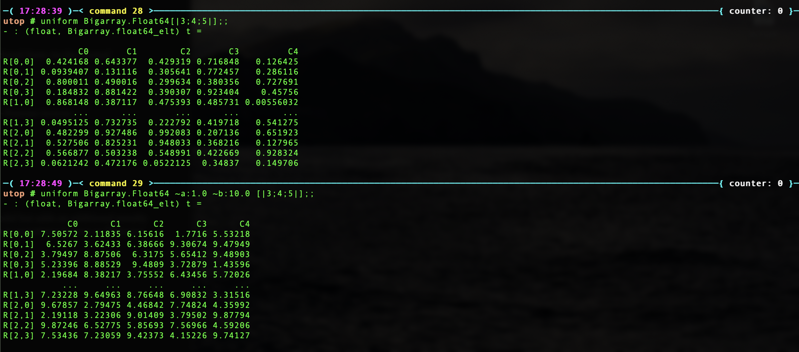
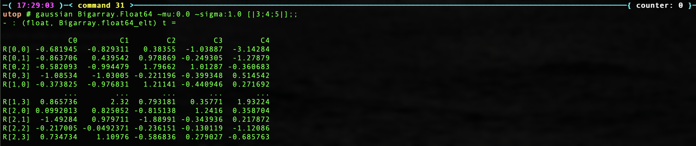
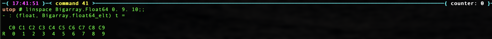
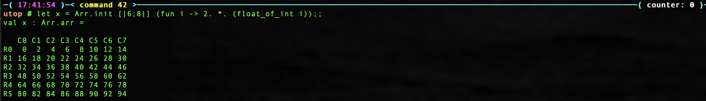
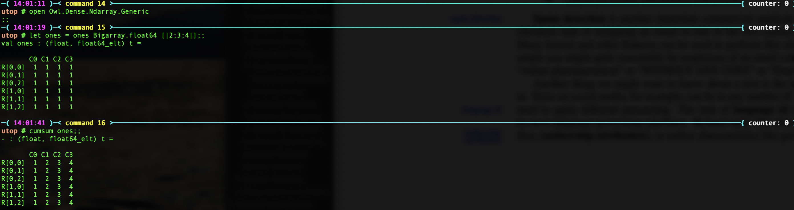
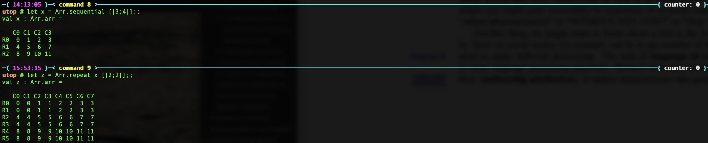
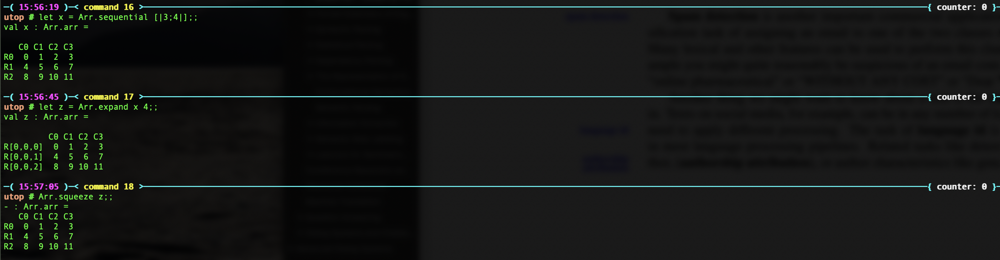
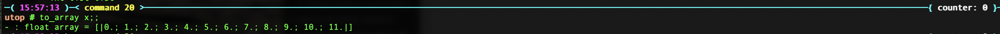

(This is my study note on [OCaml Scientific Computing 1st Edition](https://ocaml.xyz/owl_tutorials/ndarray.html))

## Ndarray Types

* The Ndarray module is built on top of OCaml's  `Bigarray.Genarray` module.

* C-layout: row-based (memory address is continuous at the highest dimensions).

* Ndarray has a maximum of 16 dimensions.

* Matrix is just a special case of n-dimensional array.

* But the module does provide more matrix-specific functions such as iterating rows or columns, and etc.

## Creation Functions

### specific valued matrix

```ocaml
open Owl.Dense.Ndarray.Generic

val empty : ('a, 'b) kind -> int array -> ('a, 'b) t

val create : ('a, 'b) kind -> int array -> 'a -> ('a, 'b) t

val zeros : ('a, 'b) kind -> int array -> ('a, 'b) t

val ones : ('a, 'b) kind -> int array -> ('a, 'b) t
```

example:


`empty` function is different from the other three – it does not really allocate any memory until you access it. Therefore, calling empty function is very fast

### random valued matrix

```ocaml
open Owl.Dense.Ndarray.Generic

val uniform : ('a, 'b) kind -> ?a:'a -> ?b:'a -> int array -> ('a, 'b) t
```
example:


```ocaml
val gaussian : ('a, 'b) kind -> ?mu:'a -> ?sigma:'a -> int array -> ('a, 'b) t

val bernoulli : ('a, 'b) kind -> ?p:float -> int array -> ('a, 'b) t
```

example:


### equally spaced matrix

```ocaml
val sequential : ('a, 'b) kind -> ?a:'a -> ?step:'a -> int array -> ('a, 'b) t

val linspace : ('a, 'b) kind -> 'a -> 'a -> int -> ('a, 'b) t

val logspace : ('a, 'b) kind -> ?base:float -> 'a -> 'a -> int -> ('a, 'b) t
```

example: 
* First arg: begin
* Second arg: end
* Third arg: # intervals



### flexible initialisation
```ocaml
val init : ('a, 'b) kind -> int array -> (int -> 'a) -> ('a, 'b) t
```
``init Bigarray.Float64 d f`` creates a ndarray ``x`` of shape ``d``, then uses
``f`` to initialise the elements in ``x``. The input of ``f`` is 1-dimensional
index of the ndarray. You need to explicitly convert it if you need N-dimensional
index. The function ``ind`` can help you.

example:
create an ndarray where all elements are even numbers



```ocaml
val init_nd : ('a, 'b) kind -> int array -> (int array -> 'a) -> ('a, 'b) t
```
The difference between `init` and `init_nd` is: `init` passes 1-d indices to the user-defined function whereas `init_nd` passes n-dimensional indices. As a result, `init_nd` is more convenient since you don't have to convert the index by
yourself but `init` is much faster. 


## Properties Functions
The functions listed below can be used to query an Narray's properties.

```ocaml
open Owl.Dense.Ndarray.Generic

val shape : ('a, 'b) t -> int array
(** [shape x] returns the shape of ndarray [x]. *)

val num_dims : ('a, 'b) t -> int
(** [num_dims x] returns the number of dimensions of ndarray [x]. *)

val nth_dim : ('a, 'b) t -> int -> int
(** [nth_dim x] returns the size of the nth dimension of [x]. *)

val numel : ('a, 'b) t -> int
(** [numel x] returns the number of elements in [x]. *)

val nnz : ('a, 'b) t -> int
(** [nnz x] returns the number of non-zero elements in [x]. *)

val density : ('a, 'b) t -> float
(** [density x] returns the percentage of non-zero elements in [x]. *)

val size_in_bytes : ('a, 'b) t -> int
(** [size_in_bytes x] returns the size of [x] in bytes in memory. *)

val same_shape : ('a, 'b) t -> ('a, 'b) t -> bool
(** [same_shape x y] checks whether [x] and [y] has the same shape or not. *)

val kind : ('a, 'b) t -> ('a, 'b) kind
(** [kind x] returns the type of ndarray [x]. *)
```

## Map Functions

`map` function transforms one ndarray to another with a given function, which is often done by applying the transformation function to every element in the original ndarray. The map function in Owl is pure (always generate a new data structure).

example:
```ocaml
let x = Arr.uniform [|3;4;5|]
let y = Arr.map (fun a -> a +. 1.) x;;
```

### Make your own vectorized functions
```ocaml
let vec_sin x = Arr.map sin x;;

let vec_cos x = Arr.map cos x;;

let vec_log x = Arr.map log x;;
```

### Index
If you need indices in the transformation function, you can use mapi function which passes in the 1-d index of the element being accessed.
```ocaml
val mapi : (int -> 'a -> 'a) -> ('a, 'b) t -> ('a, 'b) t
```

## Reduce Functions
`fold` function is often referred to as reduction in other programming languages. 

fold function has a named parameter called axis, with which you can specify along what axis you want to fold a given ndarray.

signatrue:
```ocaml
val fold : ?axis:int -> ('a -> 'a -> 'a) -> 'a -> ('a, 'b) t -> ('a, 'b) t
```
if you do not specify `~axis`, the ndarray will be flattened first folding happens along the zero dimension.

### How `sum'` is implemented:
```ocaml
open Owl.Dense.Ndarray.Generic
let sum' ?axis x = Arr.fold ?axis ( +. ) 0. x;;
```
Other functions implemented similarly:
```txt
sum
prod
prod'
min
min'
mean
mean'
```

### Index
If you need indices in folding function, you can use foldi which passes in 1-d indices:
```ocaml
val foldi : ?axis:int -> (int -> 'a -> 'a -> 'a) -> 'a -> ('a, 'b) t -> ('a, 'b) t
```

## Scan Functions
To some extent, the scan function is like the combination of map and fold. It accumulates the value along the specified axis but it does not change the shape of the input. 

Signature:
```ocaml
val scan : ?axis:int -> ('a -> 'a -> 'a) -> ('a, 'b) t -> ('a, 'b) t
```

There are several functions belong to this group, such as:
```txt
 cumsum 
 cumprod 
 cummin 
 cummax
```

Implementation of `cumsum`:
```ocaml
open Owl.Dense.Ndarray.Generic
let cumsum ?axis x = Arr.scan ?axis ( +. ) x;;
```

example:


## Comparison Functions

* Group 1: compares two ndarrays then returns a boolean value.

```ocaml
val equal : ('a, 'b) t -> ('a, 'b) t -> bool

val not_equal : ('a, 'b) t -> ('a, 'b) t -> bool

val less : ('a, 'b) t -> ('a, 'b) t -> bool

val greater : ('a, 'b) t -> ('a, 'b) t -> bool

...
```

* Group 2: compares two ndarrays but returns an 0-1 ndarray of the same shape. The elements where the predicate is satisfied have value 1 otherwise 0.

```ocaml
val elt_equal : ('a, 'b) t -> ('a, 'b) t -> ('a, 'b) t

val elt_not_equal : ('a, 'b) t -> ('a, 'b) t -> ('a, 'b) t

val elt_less : ('a, 'b) t -> ('a, 'b) t -> ('a, 'b) t

val elt_greater : ('a, 'b) t -> ('a, 'b) t -> ('a, 'b) t

...
```

* Group 3: compares an ndarray with a scalar value, the return is a boolean value.

```ocaml
val equal_scalar : ('a, 'b) t -> 'a -> bool

val not_equal_scalar : ('a, 'b) t -> 'a -> bool

val less_scalar : ('a, 'b) t -> 'a -> bool

val greater_scalar : ('a, 'b) t -> 'a -> bool

...
```

* Group 4: The fourth group is similar to the second one but compares an ndarray with a scalar value, the return is an 0-1 ndarray.

```ocaml
val elt_equal_scalar : ('a, 'b) t -> 'a -> ('a, 'b) t

val elt_not_equal_scalar : ('a, 'b) t -> 'a -> ('a, 'b) t

val elt_less_scalar : ('a, 'b) t -> 'a -> ('a, 'b) t

val elt_greater_scalar : ('a, 'b) t -> 'a -> ('a, 'b) t

...
```

It's recommended to use operators if possible for conciseness.

Owl.Ext module provides a set of operators to allow you to interoperate on different number types, as below. It automatically casts types for you if necessary.

```
=============    =============     ==========================     ==============
Operator         Example           Operation                      Functions
=============    =============     ==========================     ==============
`=`              `x = y`           comparison, return bool        equal 
`!=`             `x != y`          comparison, return bool        not_equal 
`<>`             `x <> y`          same as `!=`
`>`              `x > y`           comparison, return bool        greater 
`<`              `x < y`           comparison, return bool        less 
`>=`             `x >= y`          comparison, return bool
`<=`             `x <= y`          comparison, return bool
`=.`             `x =. y`          element_wise comparison        elt_equal 
`!=.`            `x !=. y`         element_wise comparison        elt_not_equal
`<>.`            `x <>. y`         same as `!=.`
`>.`             `x >. y`          element_wise comparison        elt_greater
`<.`             `x <. y`          element_wise comparison        elt_less
`>=.`            `x >=. y`         element_wise comparison
`<=.`            `x <=. y`         element_wise comparison
`%`              `x % y`           element_wise mod divide
=============    =============     ==========================     ==============
```

### Case study
Problem: keep the elements greater than 0.5 as they are but set the rest to zeros in an ndarray.

Solutions:
```ocaml
let x = Arr.uniform [|10; 10|];;

(* the first solution *)
let y = Arr.map (fun a -> if a > 0.5 then a else 0.) x;;

(* the second solution *)
let z = Arr.((x >.$ 0.5) * x);;  
```
The second solution is more concise. Plus it sometimes outperforms the first at the price of higher memory consumption, because the loop is done in C rather than in OCaml.


## Iteration Functions

Owl also provides iter and iteri functions with which you can iterate over all the elements in an ndarray.
```ocaml
val iteri :(int -> 'a -> unit) -> ('a, 'b) t -> unit

val iter : ('a -> unit) -> ('a, 'b) t -> unit
```

One common use case is iterating all the elements and checks if one (or several) predicate is satisfied, there is a special set of iteration functions to help you finish this task.
```ocaml
val is_zero : ('a, 'b) t -> bool

val is_positive : ('a, 'b) t -> bool

val is_negative : ('a, 'b) t -> bool

val is_nonpositive : ('a, 'b) t -> bool

val is_nonnegative : ('a, 'b) t -> bool

val is_normal : ('a, 'b) t -> bool
```

The predicates can be very complicated sometimes. In that case you can use the following three functions to pass in arbitrarily complicated functions to check them.
```ocaml
val exists : ('a -> bool) -> ('a, 'b) t -> bool

val not_exists : ('a -> bool) -> ('a, 'b) t -> bool

val for_all : ('a -> bool) -> ('a, 'b) t -> bool
```
All aforementioned functions only tell us whether the predicates are met or not. They cannot tell which elements satisfy the predicate. The following filter function can return the 1-d indices of those elements satisfying the predicates.
```ocaml
val filteri : (int -> 'a -> bool) -> ('a, 'b) t -> int array

val filter : ('a -> bool) -> ('a, 'b) t -> int array
```
We have mentioned many times that 1-d indices will be passed in. The reason is passing in 1-d indices is way faster than passing in n-d indices. However, if you do need n-dimensional indices, you can use the following two functions to convert between 1-d and 2-d indices, both are defined in Owl.Utils module.
```ocaml
val ind : ('a, 'b) t -> int -> int array
(* 1-d to n-d index conversion *)

val i1d : ('a, 'b) t -> int array -> int
(* n-d to 1-d index conversion *)
```
Note that you need to pass in the original ndarray because the shape information is required for calculating index conversion.

## Manipulation Functions

### Tile and repeat an ndarray along an axis
Tile
```ocaml
let x = Arr.sequential [|3;4|];;
let y = Arr.tile x [|2;2|];;
```

Repeat

```ocaml
let z = Arr.repeat x [|2;1|];;
```


### Expand/Squeeze an ndarray

```ocaml
(*expand the dimensionality*)
val expand : ('a, 'b) t -> int -> ('a, 'b) t

(*squeeze out dimensions having only one element*)
val squeeze : ?axis:int array -> ('a, 'b) t -> ('a, 'b) t

(*padding elements to an existing ndarray*)
val pad : ?v:'a -> int list list -> ('a, 'b) t -> ('a, 'b) t
```


### Concatenate and split

```ocaml
(*concatenate an array of ndarrays along the specified axis*)
val concatenate : ?axis:int -> ('a, 'b) t array -> ('a, 'b) t

val split : ?axis:int -> int array -> ('a, 'b) t -> ('a, 'b) t array
```

operators:
```ocaml
(*for concatenating horizontally (i.e. along axis 1)*)
@||

(*for concatenating vertically (i.e. along axis 0)*)
@=
```

### Sort
```ocaml
val sort : ('a, 'b) t -> unit
```

### Convert ndarrays to OCaml arrays

```ocaml
val of_array : ('a, 'b) kind -> 'a array -> int array -> ('a, 'b) t

val to_array : ('a, 'b) t -> 'a array
```




## Serialisation

```ocaml
val save : out:string -> ('a, 'b) t -> unit

val load : ('a, 'b) kind -> string -> ('a, 'b) t
```

You need to pass in type information in load function otherwise Owl cannot figure out what is contained in the chunk of binary file. 

Alternatively, you can use the corresponding load functions in S/D/C/Z module to save the type information.

example:
```ocaml
let x = Mat.uniform 8 8 in
Mat.save "data.mat" x;
let y = Mat.load "data.mat" in
Mat.(x = y);;
```