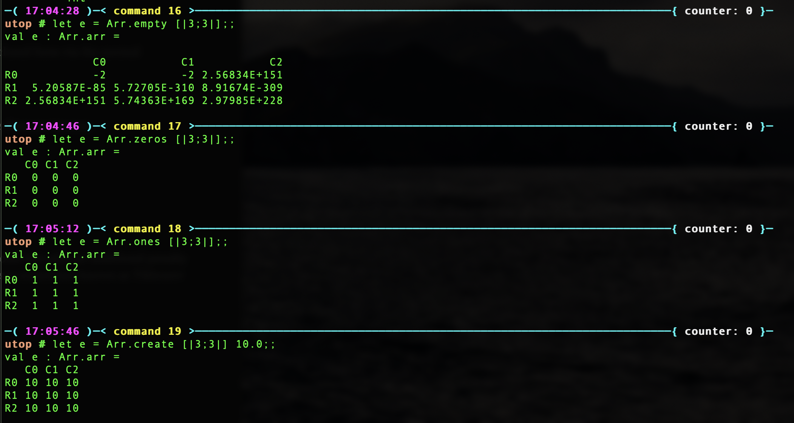
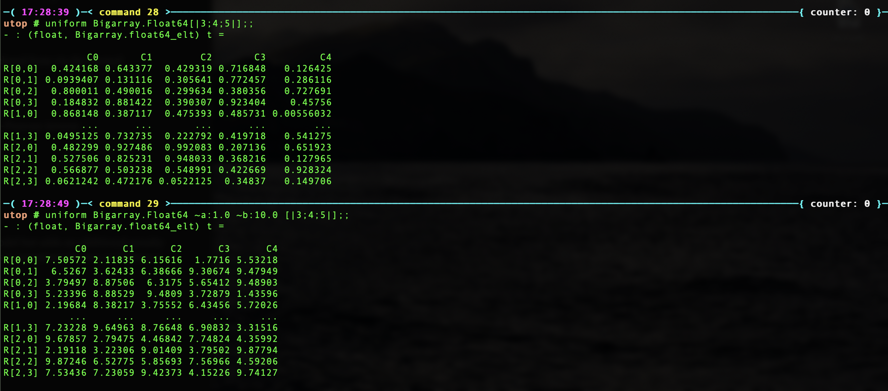
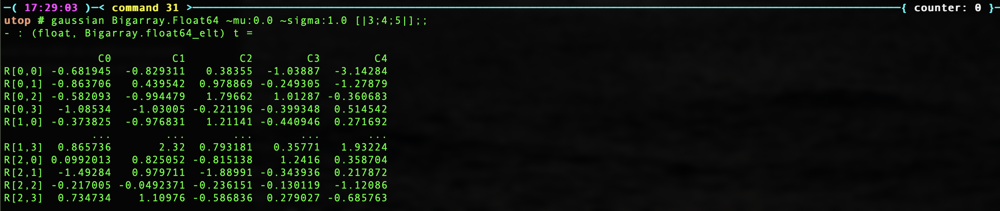
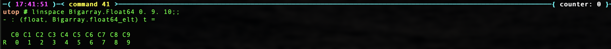
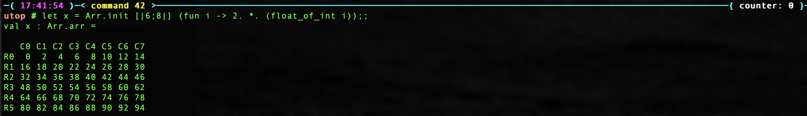

(This is my study note on [OCaml Scientific Computing 1st Edition](https://ocaml.xyz/owl_tutorials/ndarray.html))

## Ndarray Types

* The Ndarray module is built on top of OCaml's  `Bigarray.Genarray` module.

* C-layout: row-based (memory address is continuous at the highest dimensions).

* Ndarray has a maximum of 16 dimensions.

* Matrix is just a special case of n-dimensional array.

* But the module does provide more matrix-specific functions such as iterating rows or columns, and etc.

## Creation Functions

### specific valued matrix

```ocaml
open Owl.Dense.Ndarray.Generic

val empty : ('a, 'b) kind -> int array -> ('a, 'b) t

val create : ('a, 'b) kind -> int array -> 'a -> ('a, 'b) t

val zeros : ('a, 'b) kind -> int array -> ('a, 'b) t

val ones : ('a, 'b) kind -> int array -> ('a, 'b) t
```

example:


`empty` function is different from the other three – it does not really allocate any memory until you access it. Therefore, calling empty function is very fast

### random valued matrix

```ocaml
open Owl.Dense.Ndarray.Generic

val uniform : ('a, 'b) kind -> ?a:'a -> ?b:'a -> int array -> ('a, 'b) t
```
example:


```ocaml
val gaussian : ('a, 'b) kind -> ?mu:'a -> ?sigma:'a -> int array -> ('a, 'b) t

val bernoulli : ('a, 'b) kind -> ?p:float -> int array -> ('a, 'b) t
```

example:


### equally spaced matrix

```ocaml
val sequential : ('a, 'b) kind -> ?a:'a -> ?step:'a -> int array -> ('a, 'b) t

val linspace : ('a, 'b) kind -> 'a -> 'a -> int -> ('a, 'b) t

val logspace : ('a, 'b) kind -> ?base:float -> 'a -> 'a -> int -> ('a, 'b) t
```

example: 
* First arg: begin
* Second arg: end
* Third arg: # intervals



### flexible initialisation
```ocaml
val init : ('a, 'b) kind -> int array -> (int -> 'a) -> ('a, 'b) t
```
``init Bigarray.Float64 d f`` creates a ndarray ``x`` of shape ``d``, then uses
``f`` to initialise the elements in ``x``. The input of ``f`` is 1-dimensional
index of the ndarray. You need to explicitly convert it if you need N-dimensional
index. The function ``ind`` can help you.

example:
create an ndarray where all elements are even numbers



```ocaml
val init_nd : ('a, 'b) kind -> int array -> (int array -> 'a) -> ('a, 'b) t
```
The difference between `init` and `init_nd` is: `init` passes 1-d indices to the user-defined function whereas `init_nd` passes n-dimensional indices. As a result, `init_nd` is more convenient since you don't have to convert the index by
yourself but `init` is much faster. 