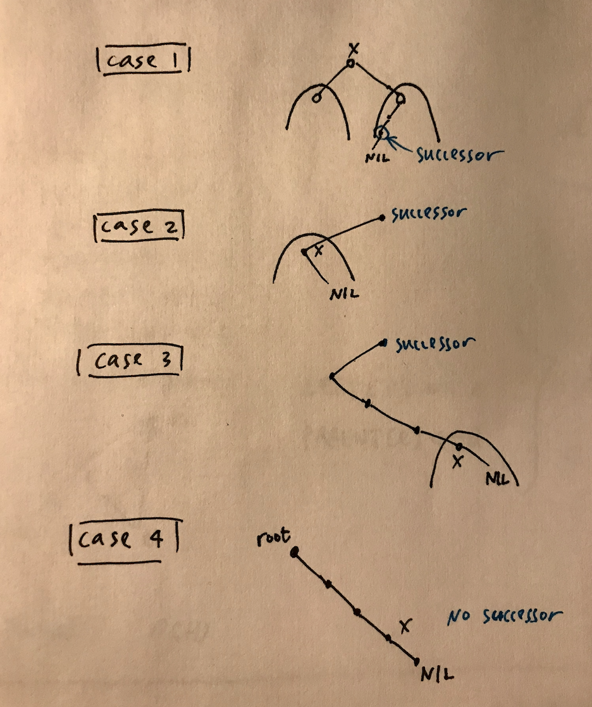

Finding the successor to a given node can be a tricky task in BST, because there are potentially many cases you'd have to deal with, and several of the cases make you run up and down a tree. Gah!


## 285. [Inorder Successor in BST](https://leetcode.com/problems/inorder-successor-in-bst/)

Given a binary search tree and a node in it, find the in-order successor of that node in the BST.

The successor of a node p is the node with the smallest key greater than `p.val`.


### Solution 1

We can break the problem down into four cases as shown in the picture below: 

* when node `p` has a right child, its successor is the **min** node down the right subtree.

* when node `p` has no right child, but `p` is the left child of another node, this parent node is the successor.

* when node `p` has no right child, `p` is the right child of its parent, but somewhere up the line a grandparent is a right child of a grand-grandparent, that grand-grandparent is the successor.

* when node `p` has no right child, and all its parent and grandparent are right child, there's no successor.

So apparently, we need a subroutine to locate the min node in a subtree -- It's the easiest when `p` has a right child, we just call this subroutine.

It's not so easy when we need to trace back to `p`'s parent, or even grand-parent. Since we don't want to iterate over all tree nodes, we'll need some mechanism to pass down information to the child while calling recursive functions. What I decided to do is to pass a `potential successor` node as an extra parameter.



```java
/**
 * Definition for a binary tree node.
 * public class TreeNode {
 *     int val;
 *     TreeNode left;
 *     TreeNode right;
 *     TreeNode(int x) { val = x; }
 * }
 */
class Solution {
    public TreeNode inorderSuccessor(TreeNode root, TreeNode p) {
        if(root.val == p.val)
            return treeMin(root.right); // min of right subtree
        if(root.val < p.val)
            return descendRightTree(root.right, p, null);
        else //(root.val > p.val)
            return descendLeftTree(root, root.left, p);
    }

    public TreeNode treeMin(TreeNode n) {
        //return the min index in a subtree
        if(n == null)
            return null;  // empty tree
        if(n.left == null)
            return n;
        else return treeMin(n.left);
    }

    public TreeNode descendLeftTree(TreeNode parent, TreeNode cur, TreeNode p){
        if(cur == null)
            return null;
        if(cur.val == p.val && cur.right == null)
            return parent;
        if(cur.val == p.val && cur.right != null)
            return treeMin(cur.right);
        if(cur.val > p.val)
            return descendLeftTree(cur, cur.left, p);
        else  //(cur.val < p.val)
            return descendRightTree(cur.right, p, parent);
    }
    
    public TreeNode descendRightTree(TreeNode cur, TreeNode p, TreeNode grand_parent){
        if(cur == null)
            return null;
        if(cur.val == p.val){
            if(cur.right != null || grand_parent == null)
                return treeMin(treeMin(cur.right));
            else 
                return grand_parent;
        }
        if(cur.val < p.val)
            return descendRightTree(cur.right, p, grand_parent);
        else 
            return descendLeftTree(cur, cur.left, p);
    }
}
```
* Runtime: 2 ms, faster than 100.00% of Java online submissions for Inorder Successor in BST.

* Memory Usage: 36.5 MB, less than 5.26% of Java online submissions for Inorder Successor in BST.


### Solution 2

Below is the solution given by LeetCode. 

Instead of analyzing the problem in 4 cases, it broke it down to 2 cases (fundamentally the same with Solution 1): 

* If the node has a right child, the successor is somewhere lower in the tree. In this case, go one step right and then left till you can. This approach has $${O}(H_p)$$ time complexity, where $$H_p$$is a height of the node p.

* Otherwise, the successor is somewhere upper in the tree. Here, instead passing information with an extra parameter, stack is used. The idea is to keep just one previous node during the inorder traversal. If that previous node is equal to p, then the current node is a successor of p.

    * Go left till you can, adding nodes in stack.

    * Pop out the last node. If its predecessor is equal to p, return that last node. Otherwise, save that node to be the predecessor in the next turn of the loop.

    * Go one step right.
This approach has $${O}(H)$$ time complexity. Basically, this approach is universal and could be used for the case 1 as well. We simply don't do that because the approach 1 is faster.

```java
class Solution {
  public TreeNode inorderSuccessor(TreeNode root, TreeNode p) {
    // the successor is somewhere lower in the right subtree
    // successor: one step right and then left till you can
    if (p.right != null) {
      p = p.right;
      while (p.left != null) p = p.left;
      return p;
    }

    // the successor is somewhere upper in the tree
    ArrayDeque<TreeNode> stack = new ArrayDeque<>();
    int inorder = Integer.MIN_VALUE;

    // inorder traversal : left -> node -> right
    while (!stack.isEmpty() || root != null) {
      // 1. go left till you can
      while (root != null) {
        stack.push(root);
        root = root.left;
      }

      // 2. all logic around the node
      root = stack.pop();
      // if the previous node was equal to p
      // then the current node is its successor
      if (inorder == p.val) return root;
      inorder = root.val;

      // 3. go one step right
      root = root.right;
    }

    // there is no successor
    return null;
  }
}
```

* Runtime: 2 ms, faster than 100.00% of Java online submissions for Inorder Successor in BST.

* Memory Usage: 37.2 MB, less than 5.06% of Java online submissions for Inorder Successor in BST.