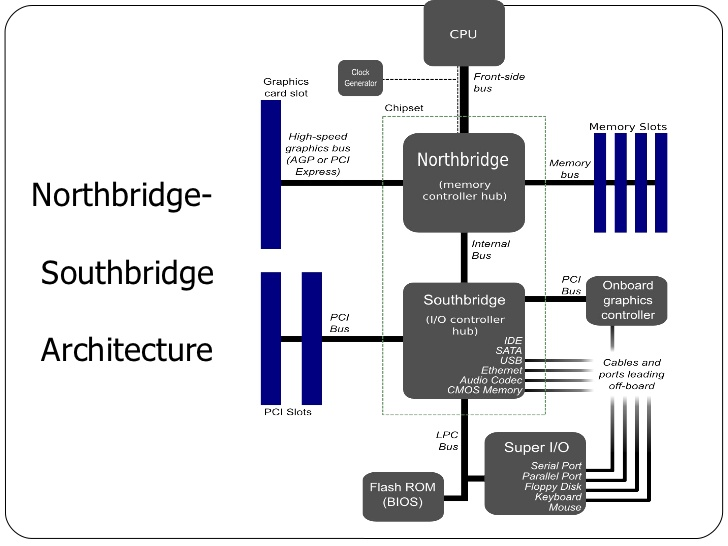

This series contains my note taken from [What Every Programmer Should Know About Memory](https://people.freebsd.org/~lstewart/articles/cpumemory.pdf).

## 1. Introduction

Background: mass storage and memory subsystems improved slowly relative to other components -- bottlenecks developed.

Deal with slowness of mass storage with `software` techniques:

* OS keeps most often used (and most likely to be used) data in **main memory**, which can be accessed at a rate **order of magnitude** faster than the hard disk. 

Improving memory subsystems:

* cache storage was added to the storage devices, which requires no changes in the OS to increase performance (but changes are required to garantee data integrity)

However, it's been very difficult to remove __main memory__ as a bottleneck and solutions require changes to the `hardware`:

* RAM hardware design (speed and parallelism)

* Memory controller designs

* CPU caches

* Direct memory access (DMA) for devices.

## 2. Commodity Hardware Review

Why not talk about specialized hardware?

* Scaling today is mostly achieved __horizontally__ instead of __vertically__, meaning it's more cost-effective to use many smaller, connected commodity hardware than a few large and exceptionally fast systems.

Two parts of a standardized chipset: 

* the Northbridge
* the Southbridge

All CPUs are connected via a common bus, Front-side bus, to the Northbridge.

`Northbridge` contains **memory controller** which decides the type of RAMs used for the computer (different types of RAM, e.g. DRAM, SDRAM, require different memory controllers).  

To reach all other system devices, the Northbridge must communicate to the `Southbridge`, which is the 'I/I bridge' that handles communication with devices via a variety of different buses.

Consequences  of the tw-bridge structure:

* All data communication from one CPU to another must travel over the same bus: FSB

* All communication with RAM must pass through the Northbridge

* The RAM has only one port

* Communication btw a CPU and a device attached to the Southbridge is routed throught the Northbridge.

Bottleneck 1: access to RAM for devices

* In early days, all communication with devices on either bridge had to pass through the CPU
* Fix: some devices became capable of **DMA** (direct memory access)
    * DMA, with the help of the Northbridge, allows devices to store and receive data in RAM directly without CPU intervening.
* Drawback: contention for the bandwidth of the Northbridge, because DMA requests compete with RAM access from the CPUs.

Bottleneck 2: bus from the Northbridge to RAM
* Older systems has only one bus to all the RAM chips, so parallel access isn't possible.
* Recent RAM types require two separate buses (or channels) which doubles the available bandwidth. The Northbridge __interleaves memory access across the channels__.

It's important for performance to schedule memory access in ways that minimize delays, with limited bandwidth available. Processors are much faster and must wait to access memory, despite the use of CPU caches.

There's more to accessing memory than concurrency. **Access patterns** also influence the performance of the memory subsystem, esp. with multiple memory channels.

Ways to increase memory bandwidth:

* use multiple external memory controllers: instead of having the Northbridge contain the memory controller, have it connected to a number of external memory controllers so that more than one memory bus exists and therefore total available bandwidth increases. **Concurrent memory access patterns** reduce delays by simultaneously accessing different memory bancks.

* integrate memory controllers into the CPUs and attach memory to each CPU. With an architecture like this there are as many memory banks available as there are processors. On a quad-CPU machine the memory bandwidth is quadrupled **without the need for a complicated Northbridge with enormous bandwidth**.
    * disadvantages: 
        * because the machine still has to make all the memory of the system accessible to all processors, the memory is not uniform anymore (hence the name NUMA - Non-Uniform Memory Architecture - for such an architecture). 
        * Local memory (memory attached to a proces- sor) can be accessed with the usual speed. 
        * The situation is different when memory attached to another processor is accessed. In this case the __interconnects__ between the processors have to be used. 
        * Each such communication has an associated cost. We talk about **“NUMA factors”** when we describe the extra time needed to access remote memory.

In the picture above, each CPU has two immediately adjacent CPUs and one which is two interconnects away!

### 2.1  RAM Types

Why are there different types of RAM in the same machine? More specifically, why are there both **static RAM** (SRAM5) and **dynamic RAM** (DRAM)?

**static RAM** is much faster and provides the same functionality. Why is not all RAM in a machine SRAM?

* The answer is cost. SRAM is much more expensive to **produce** and to **use** than DRAM. Both these cost factors are important, the second one increasing in importance more and more.

#### Static RAM
 The picture above shows the structure of a 6 transistor SRAM cell. The core of this cell is formed by the four transistors M1 to M4 which form two cross-coupled inverters. They have two stable states, representing 0 and 1 respectively. **The state is stable as long as power on `Vdd` is available**.

It's important to note that:
* one cell requires six transistors. There are variants with four transistors but they have disadvantages.
* maintaining the state of the cell requires **constant power**.
*  the cell state is available for reading almost immediately once the word access line WL is raised. The signal is as rectangular (changing quickly between the two binary states) as other transistor-controlled signals.
*  the cell state is stable, no refresh cycles are needed.

#### Dynamic RAM

The structure of DRAM is much simpler, all it consists of is one transistor and one capacitor.

A dynamic RAM cell keeps its state in the capacitor C. The transistor M is used to guard the access to the state. 
* Read:  access line AL is raised; this either causes a current to flow on the data line DL or not, depending on the charge in the capacitor

* Write: data line DL is appropriately set and then AL is raised for a time long enough to charge or drain the capacitor.

**Problem 1: Leakage**

The use of a capacitor means that reading the cell discharges the capacitor. The procedure cannot be repeated indefinitely, the capacitor must be recharged at some point. It only takes a short time for the capacity of a fully charged capacitor to dissipate. This problem is called “leakage”.

This leakage is why a DRAM cell must be **constantly refreshed**. For most DRAM chips these days this refresh must happen every 64ms. During the refresh cycle no access to the memory is possible since a refresh is simply a memory read operation where the result is discarded. For some workloads this overhead might stall up to 50% of the memory accesses.

**Problem 2**

Resulting from the tiny charge is that the information read from the cell is not directly usable. The data line must be connected to a sense amplifier.

**Problem 3**

Reading a cell causes the charge of the capacitor to be depleted. This means **every read operation must be followed by an operation to recharge the capacitor**. This is done automatically by feeding the output of the sense amplifier back into the capacitor. It does mean, though, the *reading memory content requires additional energy and, more importantly, time*.

**Problem 4**

Charging and draining a capacitor is not instantaneous. The signals received by the sense amplifier are not rectangular, so a conservative estimate as to when the output of the cell is usable has to be used. 

**Advantage**

Size. 

The chip real estate needed for one DRAM cell is many times smaller than that of an SRAM cell. The SRAM cells also need individual power for the transistors maintaining the state.

The structure of the DRAM cell is also simpler and more regular which means packing many of them close together on a die is simpler.

Overall, cost wins. We have to live with main memory based on DRAM.

#### DRAM Access

Memory access process:
* Program selects a memory location w/ virtual address --> 
* Processor translates this into a physical address --> 
* Memory controller selects the RAM chip corresponding to the address. 

To select the individual memory cell on the RAM chip, parts of the physical address are passed on in the form of a number of **address lines**.

It would be completely impractical to address memory locations individually from the memory controller: 4GB of RAM would require 232 address lines. 

Instead the address is passed encoded as a binary number using a smaller set of address lines. The address passed to the DRAM chip this way must be **demultiplexed** first. A demultiplexer with N address lines will have 2N output lines. These output lines can be used to select the memory cell. 

Using this direct approach is no big problem for chips with small capacities. But if the number of cells grows this approach is not suitable anymore. The size of a demultiplexer increases exponentially with the number of input lines when speed is not to be sacrificed. 

The DRAM cells are organized in rows and columns. They could all be aligned in one row but then the DRAM chip would need a huge demultiplexer. With the array ap- proach the design can get by with one demultiplexer and one multiplexer of half the size. This is a huge saving on all fronts.

#### Conclusion

* memory cells need to be individually selected to be used
* the number of address lines is directly responsible for the cost of the memory controller, motherboards, DRAM module, and DRAM chip
* it takes a while before the results of the read or write operation are available

### 2.2 DRAM Access Technical Details

### 2.3 Other Main Memory Users