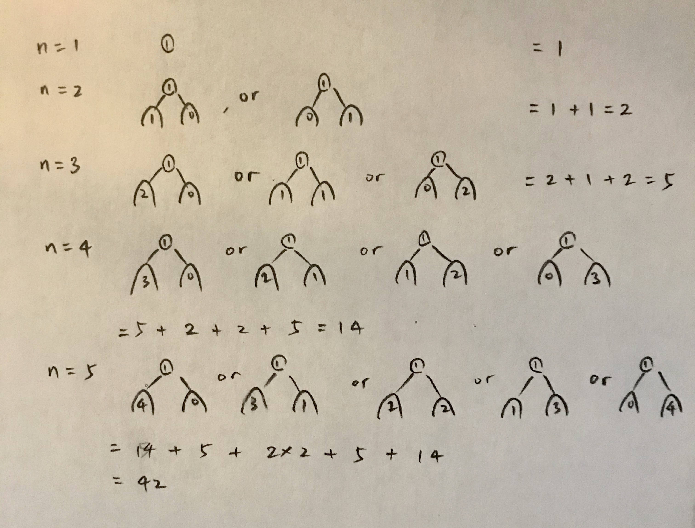

## [1214. Two Sum BSTs](https://leetcode.com/problems/two-sum-bsts/)
Given two binary search trees, return True if and only if there is a node in the first tree and a node in the second tree whose values sum up to a given integer target.

### Thought Process

If we collect both trees and save all values into two HashSet, the time cost is gonna be: `O(m + n + n*1) = O(m+2n)`, this seems okay but the memory cost is high `O(m + n)`.

If we'd like to utilize the BST property, space could be saved. We can iterate over one of the trees meanwhile do a binary search on the other tree for the complement value. This is going to cost `O(m * h)` or `O(m * logn)` time if n is balanced. Memory usage is cut down to the `O(h)` stacks used while descending down the tree. `h = height(tree1) > height(tree2) ? height(tree1) : height(tree2)`.

### My Solution

The solution below achieved 100% on both memory and runtime.

```java
/**
 * Definition for a binary tree node.
 * public class TreeNode {
 *     int val;
 *     TreeNode left;
 *     TreeNode right;
 *     TreeNode(int x) { val = x; }
 * }
 */
class Solution {
    public boolean twoSumBSTs(TreeNode root1, TreeNode root2, int target) {
        if(root1 == null || root2 == null) return false;
        if(search(root2, target - root1.val)) return true; 
        
        return twoSumBSTs(root1.left, root2, target) || twoSumBSTs(root1.right, root2, target);
    }
    
    /*
    Time Cost: O(h)
    Space cost: O(h) stacks
    */
    public boolean search(TreeNode root2, int target){
        if(root2 == null) return false;
        if(root2.val == target) return true;
        if(root2.val < target) 
            return search(root2.right, target);
        else 
            return search(root2.left, target);
    }
}
```

## [96. Unique Binary Search Trees](https://leetcode.com/problems/unique-binary-search-trees/)

Given n, how many structurally unique BST's (binary search trees) that store values 1 ... n?

### Observations

* Once the root is decided, the range of each subtree is decided.

* Can use dynamic programming -- subproblem structure is quite clear.



### My Solution

```java
class Solution {
    
    public int numTrees(int n) {
        HashMap<Integer, Integer> map = memoize(n);
        
        return map.get(n);
    }
    
    public HashMap<Integer, Integer> memoize(int n){
        // build a map from tree size to number of unique trees, bottom-up
        HashMap<Integer, Integer> map = new HashMap<>();
        map.put(0, 1); 
        map.put(1, 1);
        
        for(int m = 2; m <= n; m++){
            int cnt = 0;
            for(int i = 0; i < m; i++){
                Pair p = split(i, m);
                cnt += map.get(p.left) * map.get(p.right);
            }
            map.put(m, cnt);
        }
        return map;
    }
    
    public Pair split(int ind, int n){
        // given index of the root, return sizes of the left subtree and the right subtree
        return new Pair(ind, n - 1 - ind);
    }

    private class Pair{
        int left;
        int right;
        Pair(int l, int r){
            left = l;
            right = r;
        }
    }
}
```

This solution is very slow though:

* Runtime: 1 ms, faster than 13.52% of Java online submissions for Unique Binary Search Trees.
* Memory Usage: 32.9 MB, less than 5.55% of Java online submissions for Unique Binary Search Trees.

### LeetCode Solution
```java
public class Solution {
  public int numTrees(int n) {
    int[] G = new int[n + 1];
    G[0] = 1;
    G[1] = 1;

    for (int i = 2; i <= n; ++i) {
      for (int j = 1; j <= i; ++j) {
        G[i] += G[j - 1] * G[i - j];
      }
    }
    return G[n];
  }
}
```

## [95. Unique Binary Search Trees II](https://leetcode.com/problems/unique-binary-search-trees-ii/)
Different from the previous problem, here you need to actually generate all these trees.

```java 
class Solution {
  public LinkedList<TreeNode> generate_trees(int start, int end) {
    LinkedList<TreeNode> all_trees = new LinkedList<TreeNode>();
    if (start > end) {
      all_trees.add(null);
      return all_trees;
    }

    // pick up a root
    for (int i = start; i <= end; i++) {
      // all possible left subtrees if i is choosen to be a root
      LinkedList<TreeNode> left_trees = generate_trees(start, i - 1);

      // all possible right subtrees if i is choosen to be a root
      LinkedList<TreeNode> right_trees = generate_trees(i + 1, end);

      // connect left and right trees to the root i
      for (TreeNode l : left_trees) {
        for (TreeNode r : right_trees) {
          TreeNode current_tree = new TreeNode(i);
          current_tree.left = l;
          current_tree.right = r;
          all_trees.add(current_tree);
        }
      }
    }
    return all_trees;
  }

  public List<TreeNode> generateTrees(int n) {
    if (n == 0) {
      return new LinkedList<TreeNode>();
    }
    return generate_trees(1, n);
  }
}
```